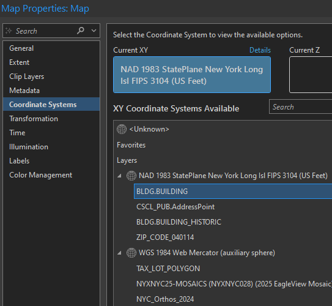
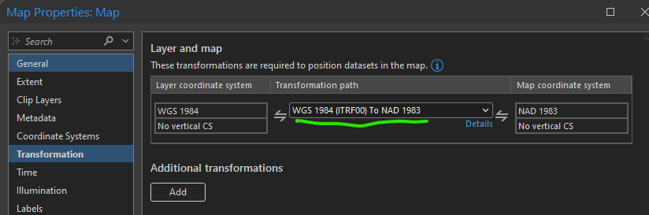

# BUILDING FOOTPRINT Edit Protocols

Updated 10/07/2026

## Contents

- [Mindset](#mindset)
- [Editing Protocol](#editing-protocol)
- [Attribute Protocol](#attribute-protocol)
- [Ticket Protocol](#ticket-protocol)
- [Data Sources](#data-sources)
- [Project Setup and Other Tips](#project-setup-and-other-tips)

## Mindset

For newly constructed, altered, and demolished buildings, we (OTI) do not ordinarily perform research of our own to drive building editing. Our main goal is to work with DCP to synchronize the building information that is in Geosupport/PAD with OTI building footprints. We don't want to perform our own research and duplicate the work that DCP is doing.

We make exceptions to this reactive approach when correcting or updating incorrect or stale data. Our proactive editing includes periodic QA work that we submit as tickets to ourselves. It also includes day-to-day editing of anything we see that looks wrong, like a poorly digitized building that we encounter when working nearby.

Given the complexity and incredible volume of work we also follow these wise adages:

- "You do the best you can."
- "It is what it is."

## Editing Protocol

### Versions

1. Create a public working version under `BLDG_DOITT_EDIT`.
2. Editors typically create one version per day named like `mgoya_bldg_yyyymmdd`.
3. Be sure to reconcile and post your version often to prevent loss of work.
4. You do not need to delete your version at the end of the day. Editors confirm CSCL edits each morning and usually delete their building edit version at the same time.

### New Buildings

1. Try to capture the shape as accurately as possible using straight line segments (no curves). Ask about controls to create parallel lines and 90-degree angles if you don't know how to do this.
2. If no imagery exists, use DOB BIS Zoning diagram and do the best you can.
3. Try to keep the footprint inside the tax lot as much as possible, but only if it doesn't distort the shape too much. How much is too much? Let's start out with a maximum 2-foot deviation from the actual image building wall location.
4. For all new building footprints we are deleting the old address point and adding a new one. This applies even if the house number does not change.
5. Only use `FEATURE_CODE`: Placeholder with footprint shape triangles when necessary. These are necessary when start of construction is on hold or public safety insists on a placeholder. If you can make a good guess at the likely shape and location of the building footprint draw it.

### Demolitions

1. Copy the footprint from `BUILDING` and paste special into `BUILDING_HISTORIC`.
2. Update the `BUILDING_HISTORIC` `LAST_STATUS_TYPE` to Demolition and set the `DEMOLITION_YEAR`.
3. **Bad buildings/sheds/corrections:** If a footprint existed long enough to have a BIN and DCP wants it gone, move it to `BUILDING_HISTORIC` and set the `LAST_STATUS_TYPE` to "Demolition." It is demolished from the database, not meatspace.
4. Leave all other attributes, including `GEOM_SOURCE`, alone.
5. Delete the associated CSCL AddressPoint feature.
6. Also check CSCL common places for possible deletions.
7. Delete the existing CSCL AddressPoint and if there is a new building, create a new address point.
8. If you demolished without DCP direction see [Ticket Protocol, item 1](#ticket-protocol) below.

### Merges or Splits

1. **For Merge:** Set `LAST_STATUS_TYPE` to "Merged" for all footprints that will be merged. Copy all footprints that will be merged to `BUILDING_HISTORIC`. In `BUILDING` select all the footprints that will be merged. Merge them into the footprint with the BIN that will be retained. Set `GEOM_SOURCE` = "Other (Manual)." Check other attributes as necessary to see if they are still correct: `BASE_BBL`, `FEATURE_CODE`.
2. **For Split:** Set `LAST_STATUS_TYPE` to "Split" for the footprint that will be split. Copy the footprint that will be split to `BUILDING_HISTORIC`. In `BUILDING` select the footprint that will be split. Split the footprint and assign the BINs to the new footprints as indicated in the ticket. The BIN assignments should be confirmed with DCP. Set `GEOM_SOURCE` = "Other (Manual)." Check other attributes as necessary to see if they are still correct: `BASE_BBL`, `FEATURE_CODE`.
3. **Notify FDNY:** Send email with a short explanation in the Subject Line (e.g. "Footprint was Split, DOITT_ID = ???????" or "Footprint was Merged, DOITT_ID = ??????") and include a screenshot with the BIN of the post-edit features in the `BUILDING` feature class. This is temporary (we hoped) until FDNY is sure they are not missing anything important when we make these changes. Send an email to: [Michael.Brady@fdny.nyc.gov](mailto:Michael.Brady@fdny.nyc.gov), cc: [mrahman@oti.nyc.gov](mailto:mrahman@oti.nyc.gov). FDNY will not acknowledge this email.

### Type 1 Alterations

1. Set `LAST_STATUS_TYPE` = "Alteration."
2. Copy and paste-special the original footprint to `BUILDING_HISTORIC` and populate the `ALTERATION_YEAR`.
3. Modify the footprint in `BUILDING`.
4. Set `GEOM_SOURCE` = "Other (Manual)" and change `HEIGHT_ROOF`, if necessary. This will allow the footprint to retain its `DOITT_ID`. The modified footprint will also retain the same BIN.

## Attribute Protocol

### NAME

Not critical. But if you see it in Cyclomedia add it.

### BIN_NUMBER

- If you can't find a BIN for a new footprint or the DOB BIS record uses the same BIN as the demolished building, add a million BIN temporarily and create a ticket for DCP to provide a BIN for the structure.
- If DCP requests that we update a BIN just update it. Simple identifier changes do not need to be recorded in `BUILDING_HISTORIC`.

### BASE BBL

- The `BASE_BBL` is the tax lot the footprint is physically located within.
- When in doubt match the real-world tax lot visible on the map. External systems that appear to be out of sync will catch up. (we're that good)

### CONSTRUCTION_YEAR (BUILDING_HISTORIC DEMOLITION_YEAR)

- Use the year when the building is first visible (for `CONSTRUCTION_YEAR`) or is no longer visible in imagery (for `DEMOLITION_YEAR`).
- Refer also to X-status in the Building Info System.
- This can be NULL for placeholder buildings. Someone will return to it.

### GEOM_SOURCE

- "Other (manual)" is the default for standard digitizing.

### LAST_STATUS_TYPE

- Our default is constructed.
- Select alteration, split, marked for construction, or merged as described here in the protocols.
- `BUILDING_HISTORIC` legal values: Demolition or Alteration.

### DOITT_ID

- Auto populated.

### HEIGHT_ROOF

- Don't leave NULL. You can get it from plans in DOB Zoning Diagrams or make measurements on Cyclomedia or Pictometry imagery.
- Use only whole numbers, no decimal places. Round up to the nearest foot.
- Set to 0 for placeholder buildings.
- Set to 0 for buildings under construction where you have no good info. Someone will revisit it later.

### FEATURE_CODE

- **Building:** The default. An addressable structure with a BIN.
- **Building Under Construction:** We will remove this. Once construction has begun a building under construction is a building.
- **Garage:** A non-addressable outbuilding with a BIN that is obviously a garage.
- **Skybridge:** An aerial structure connecting two buildings that has been assigned a BIN. Skybridges are narrow and serve solely as an aerial bridge between two structures.
- **Parking:** Addressable parking lots that have been assigned a BIN.
- **Gas Station Canopy:** For cases where there is a booth that also has a BIN below the canopy footprint, we will create overlapping footprints. The booth will have a `FEATURE_CODE` of "Building."
- **Storage Tank:** Storage tanks (gas, liquids, grain, etc.) that are assigned a BIN.
- **Placeholder:** The triangles we add when we have no data source available to add a new footprint.
- **Auxiliary Structure:** A non-garage, non-addressable, permanent structures.
- **Temporary Structure:** Structures that are temporary, but are assigned BINs and have addresses. Trailers stationed temporarily for construction projects are an example.
- **Cantilevered Building:** Crowd favorite buildings where some portion of the footprint overhangs another building footprint but is not a skybridge.

### STATUS

- Ignore. Not used.

### GROUND_ELEVATION

- Don't leave blank.
- Use elevation from Eagleview or Cyclomedia. Or if those are not applicable you can interpolate from `planimetrics_2022.elevation`.
- Don't guesstimate from neighboring buildings, that's oldskool.

### ADDRESSABLE

- Ignore. Not published. Defunct.

### MAPPLUTO_BBL

- Ignore. Automatically updated every evening during building maintenance.

### CONDO_FLAGS

- Ignore. Not used.

### ALTERATION_YEAR (BUILDING_HISTORIC)

- Populate for type 1 alterations only.

## Ticket Protocol

1. **Super Important!** If you demolish a building that did not come from a DCP ticket edit request, check to see if the BIN shows up in GOAT. If the BIN still is valid in GOAT, create a ticket for Manager DCP to inform them that the building was demolished. Here's sample text to put in the ticket:

   > Moved DOITT_ID/BIN 636668/3032880 to BUILDING_HISTORIC and deleted from BUILDING. Deleted ADDRESSPOINTID 5166316 with HOUSE_NUMBER 1550 BEDFORD AV. Please update DCP records as necessary and close this ticket.

2. Create a new ticket for anything that is required from DCP that is not part of the original edit request. Assign it to Manager DCP.
3. If you must ask DCP for clarifications or questions for an edit ticket, use the Reassign option to do it. Reassign the ticket to the original creator or to Manager DCP, depending on your experience with the creator's likelihood of responding.
4. Try not to assign yourself more tickets than you can work on in one day. This makes it easier to track what is getting done.
5. **For new buildings found by OTI:** For any "new" buildings we find while performing our normal edits, before creating a ticket to DCP requesting a BIN, check DOB BIS to see if the building is a Type 1 Alteration (no BIN change). If it is a Type 1 Alteration, we do not need to notify DCP. Edit the footprint per instructions for [Type 1 Alterations](#type-1-alterations) above or create a ticket and assign it to the CSCL manager.
6. On DCP tickets when they say "resize" or "reshape" a footprint, always check DOB on Jobs/Filings:
   1. If the building was demolished (DM), follow instructions above for [Demolitions](#demolitions).
   2. If the building was altered, follow instructions above for [Type 1 Alterations](#type-1-alterations) then make a copy of the footprint to `BUILDING_HISTORIC`, reshape the original footprint on the building layer, and check if `building_height` changed.

## Data Sources

### Raster

1. **Orthophotos:** (even-numbered years) should all be available on <https://nyc.maps.arcgis.com/>.
2. **Pictometry/EagleView CONNECT web application and ArcMap Toolbar:** You can add this imagery to your ArcGIS Pro document and heads-up digitize most buildings. If you don't know how to add this imagery, ask and we'll show you.
3. **Cyclomedia:** Don't forget that there are historical "cycloramas" you can switch to for imagery. You can measure building heights in the StreetSmart web application.
4. **Google maps (Street view):** You can time travel on some historical "Street views" as early as 2007.

### Vector

1. **CSCL data:** Use `CSCL_PUB`.
   - `CSCL_PUB` is refreshed with CSCL data every weekend.
   - ArcGIS Pro can read `CSCL_PUB` but not `CSCL`.
   - Connect as `CSCL_READ_ONLY` to view `CSCL_PUB`.
   - Add these layers:
     - `CSCL_PUB.AddressPoint`
     - `CSCL_PUB.Centerline` (inside the `CSCL_PUB.CSCL` feature dataset)
     - `CSCL_PUB.CommonPlace`
2. **Park Structures:** Download and add when you need fresh DPR data.
   - <https://data.cityofnewyork.us/dataset/NYC-Parks-Structures/n8q6-i44s>
3. **Planimetrics:**
   - Most layers are available on <https://nyc.maps.arcgis.com/>.
   - Planimetrics buildings are loaded as `BLDG.PLANIMETRICS`. Use `bldg_readonly` to access.
4. **Tax Lots:**
   - <https://services6.arcgis.com/yG5s3afENB5iO9fj/arcgis/rest/services/DTM_ETL_DAILY_view/FeatureServer/0>
   - You will find the tax lots under <https://services6.arcgis.com/yG5s3afENB5iO9fj/arcgis/rest/services>: `DTM_ETL_DAILY_view` > `TAX_LOT_POLYGON`.

## Project Setup and Other Tips

### 1. AddressPoint Labeling, VBScript

```vbscript
[HOUSE_NUMBER] & " " & [HOUSE_NUMBER_SUFFIX] & " " & [HOUSE_NUMBER_RANGE] & " " & [HOUSE_NUMBER_RANGE_SUFFIX] & " " & [FULL_STREET_NAME] & " " & [SPECIAL_CONDITION]
```

### 2. Dept of Building Permit Types

- **NB:** New building, construction of new structures.
- **ALT1:** Major alterations that will change use, egress, or occupancy.
- **ALT2:** Multiple types of work not affecting use, egress, or occupancy.
- **ALT3:** One minor type of work not affecting use, egress, or occupancy.

### 3. Get Rid of "Click to Add New Row" in ArcGIS Pro Attribute Tables

Options > Application > Table > (check) "Hide the 'Click to add new row' option for feature class tables."

### 4. Map Coordinate System

Match the building footprint source SRID: `2263`.



### 5. Transformation Path

Data stored in Web Mercator is based on the WGS84 datum. Use this transformation path to convert from WGS84 to NAD83. This transformation path will apply to all WGS84 layers (orthophoto services and ArcGIS Online).



### 6. Duplicate DOITT_IDs

1. This happens occasionally for unclear reasons. `DOITT_ID`s are auto created by custom code.
2. If you want to fix one of these you can create a new dummy building in your edit session, copy and paste the dummy building `DOITT_ID` to your real building, and then delete the dummy building.